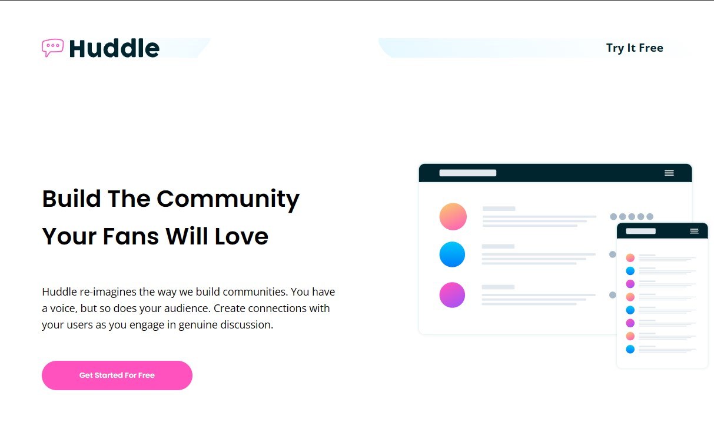

# Frontend Mentor - Huddle landing page with alternating feature blocks

## 🧾 Overview

This is a solution to the **Huddle landing page with alternating feature blocks** challenge on [Frontend Mentor](https://www.frontendmentor.io/challenges). The goal was to build a responsive landing page using the provided design and assets.

## 🛠️ Built with

- Semantic HTML5 markup
- CSS custom properties
- Flexbox
- Mobile-first workflow
- Google Fonts
- Font Awesome for social media icons

## 🚀 Live Site

[🔗 View the live site here](https://fernandopizarrodw.github.io/huddle-landing-page-alternating/)

## 📸 Screenshot

## ✨ Features

- Responsive layout for mobile and desktop.
- Alternating feature blocks.
- Social media links with Font Awesome icons.
- Clean, accessible HTML and organized CSS.

## 👨‍💻 Author

- GitHub – [@fernandopizarrodw](https://github.com/fernandopizarrodw)
- Frontend Mentor – [@fernandopizarrodw](https://www.frontendmentor.io/profile/fernandopizarrodw)
- LinkedIn – [Fernando Pizarro](https://www.linkedin.com/in/fernandopizarrodw)

---

This project was a great opportunity to improve my responsive layout skills and apply good CSS practices like BEM and mobile-first design.
